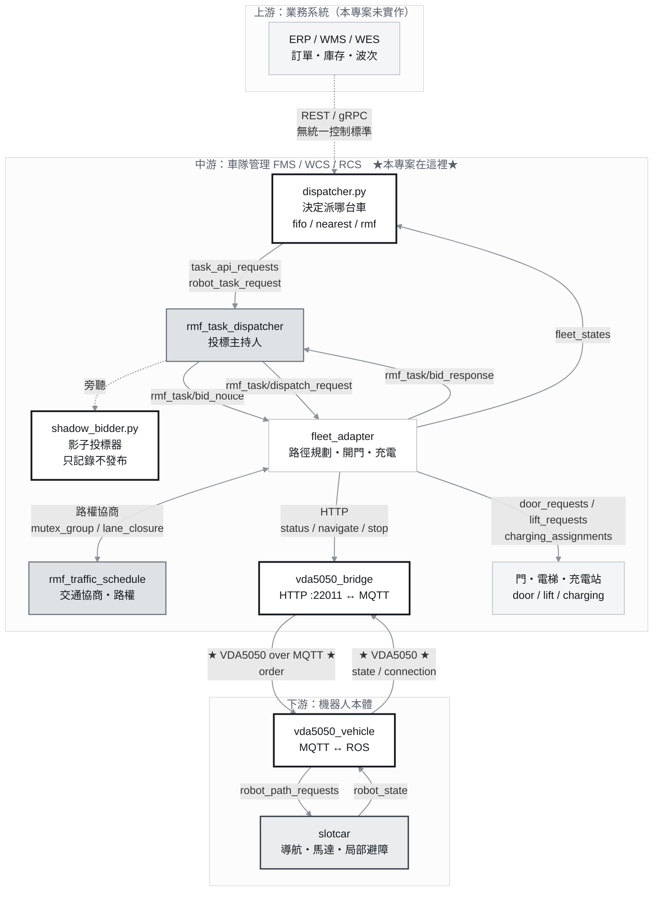
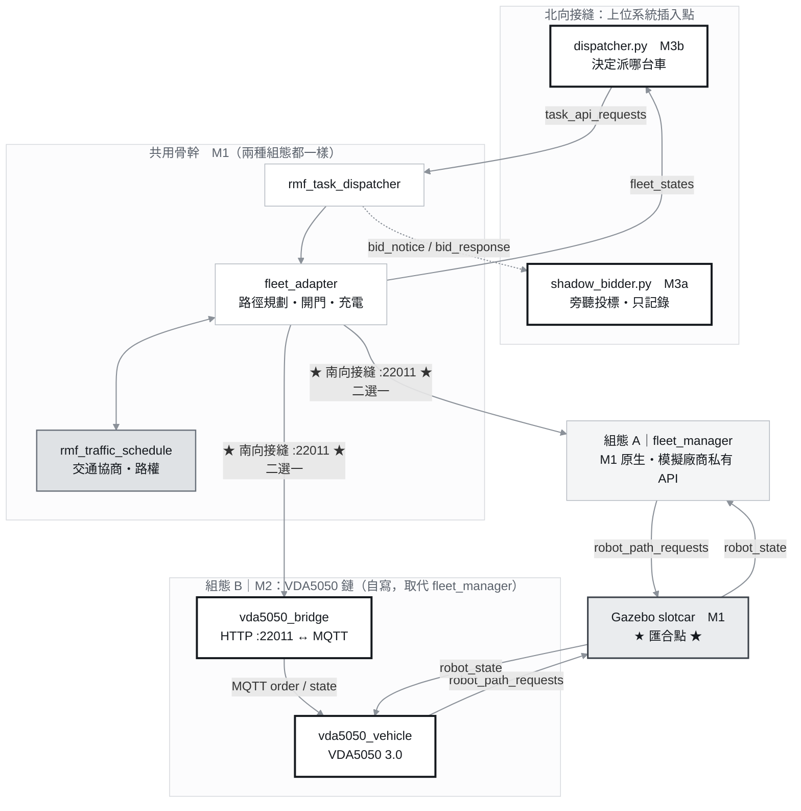
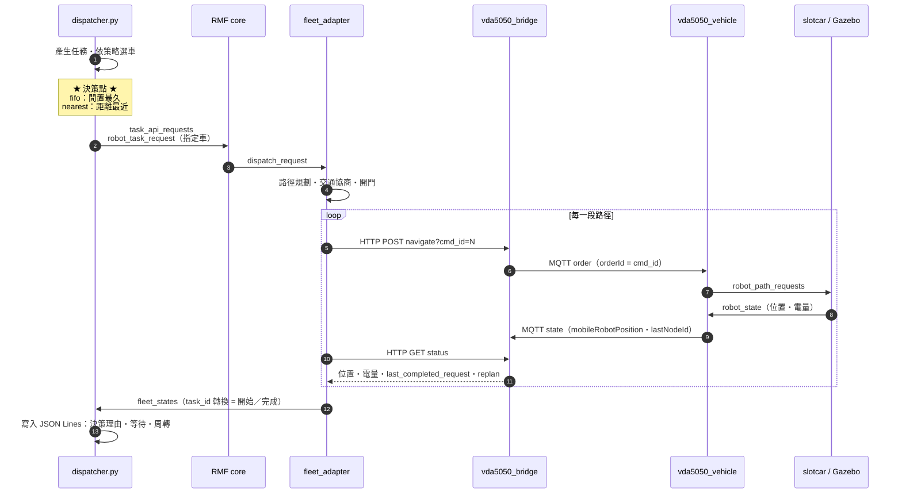
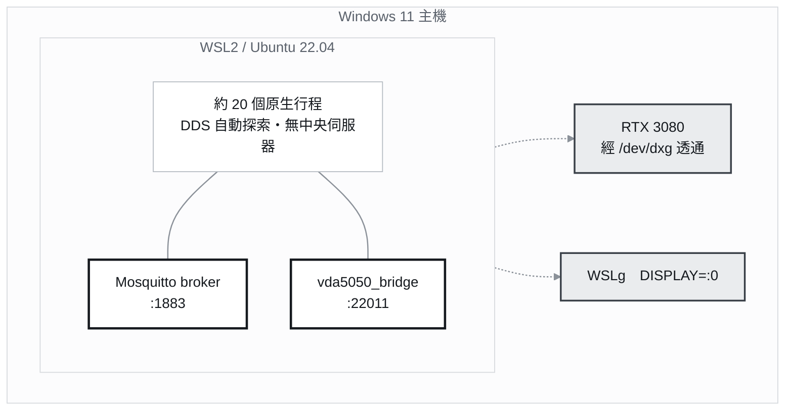

# amr-fms-fifo-dispatcher

**AMR 車隊管理（FMS／WCS）上位系統練習：把自寫的派工器接進 Open-RMF，
並用 VDA5050 3.0 取代廠商私有 API，量測「換掉介面之後 KPI 有沒有劣化」。**

環境：WSL2 / Ubuntu 22.04 / ROS 2 Humble / Open-RMF `rmf_demos` 2.0.4 / Ignition Fortress

---

## 目錄

1. [專案目的](#一專案目的)
2. [學習目標](#二學習目標)
3. [全域架構圖](#三全域架構圖)
4. [一次派工的時序圖](#四一次派工的時序圖)
5. [容器拓樸與 port](#五容器拓樸與-port)
6. [上中下游、指派行為、車輛行為](#六上中下游指派行為車輛行為)
7. [什麼是 VDA5050，為什麼要接它](#七什麼是-vda5050為什麼要接它)
8. [官方 schema 格式](#八官方-schema-格式)
9. [我們做了什麼](#九我們做了什麼)
10. [怎麼驗證](#十怎麼驗證)
11. [目錄結構與執行方式](#十一目錄結構與執行方式)
12. [邊界與已知限制](#十二邊界與已知限制)
13. [授權](#十三授權)

---

## 一、專案目的

**交付邊界只有一條線：自己寫的派工器要能接進 Open-RMF 的介面，並且用業界標準協定與車輛溝通。**

不重造 Open-RMF、不重造 rmf-web。親手寫的是四個元件：

| 元件 | 角色 |
|---|---|
| `dispatcher.py` | 上位系統：決定**派哪台車**（策略可切換 `fifo` / `nearest` / `rmf`） |
| `shadow_bidder.py` | 影子投標器：旁聽 RMF 的投標，記錄「FIFO 會選誰 vs RMF 選了誰」 |
| `vda5050_bridge.py` | 橋接：北向 HTTP（被 RMF 呼叫）↔ 南向 MQTT（VDA5050） |
| `vda5050_vehicle.py` | VDA5050 3.0 模擬車輛：MQTT ↔ ROS |

**FIFO 的邏輯是故意留笨的**——取閒置最久的車，不看距離、電量、壅塞。
這樣才能讓「近的車就在旁邊，卻派了對面的車」變成肉眼可見的問題，
也才有東西可以在後續用更好的演算法去改善。

### 里程碑

| 里程碑 | 做了什麼 | 性質 | 狀態 |
|---|---|---|---|
| **M0** | WSL2 + ROS 2 Humble 環境建置、GPU／GUI 驗證 | 底座 | ✅ |
| **M1** | 把 `rmf_demos` office 場景跑起來（**不寫任何程式碼**），確認訊息流實際長什麼樣再畫架構圖 | 底座 | ✅ |
| **M3a** | 影子投標器：旁聽 RMF 的投標，記錄「FIFO 會選誰 vs RMF 選了誰」。**只記錄不發布，零風險** | 觀察模式 | ✅ |
| **M3b** | 上位系統派工器：任務進來 → 我的策略決定派哪台車 → RMF 執行。三策略 × 兩輪對照實驗 | 元件（插在北向接縫） | ✅ |
| **M2** | 用 VDA5050 3.0 取代 `rmf_demos` 的 `fleet_manager`（模擬廠商私有 API），並量測 KPI 是否劣化 | 介面替換（南向接縫） | ✅ |
| M4–M7 | 決策可觀測性面板／更好的演算法／官方實作對照／雲端與 CI | — | ⬜ 未做 |

> **編號不等於執行順序。** 實際順序是 `M0 → M1 → M3a → M3b → M2`。
> M2 排在最後，是因為專案中途發現交付邊界偏離了——原定「實作介面**被** RMF 呼叫」，
> 實際做成「**呼叫** RMF 的 task API」。M2 正是把「被呼叫」那一側補回來的動作。

---

## 二、學習目標

| # | 目標 | 對應產出 |
|---|---|---|
| 1 | 讀懂並實作一個**業界標準介面**，而不是自己發明格式 | VDA5050 3.0 的 order／state／connection，用官方 schema 驗證 |
| 2 | 分清楚**上位系統**與**車隊控制層**的職責邊界 | 上位系統只決定派哪台車；路徑規劃、交通協商、開門、充電留給 RMF |
| 3 | 用**可量測的方式**回答「這個改動有沒有讓系統變差」 | 三策略 × 多輪對照實驗，先定雜訊底線再比較 |
| 4 | 讓實驗結果**可信、可重現** | 每個紀錄檔第一行寫入程式碼雜湊，版本不同的資料自動排除 |
| 5 | 在多行程系統裡建立**故障診斷方法** | 用可判定訊號區分「元件死了」與「元件被卡住」 |

---

## 三、全域架構圖



> **粗黑框 = 自己寫的四個元件**；**深灰底 = 決策樞紐**。
> `vda5050_bridge` 取代了 `rmf_demos` 原本的 `fleet_manager`（模擬廠商私有 API）——
> 這一段就是本專案的核心：**把假的廠商 API 換成真的業界標準介面**。

### 各里程碑怎麼串在一起：兩個接縫、一個匯合點

上圖畫的是「組態 B」（走 VDA5050）。實際上這條鏈只有**兩個地方可以插拔**，
而 M1 的原生鏈與 M2 的 VDA5050 鏈**在同一個 port 上二選一**：



**這個結構就是實驗設計本身：**

```
分岔：HTTP :22011      ← 只有這裡被換掉
固定：dispatcher、RMF 核心、Gazebo、任務序列、間隔
匯合：/robot_path_requests → 同一台 slotcar
```

只有一個變因被改動，KPI 的差異才能歸因到「換了介面」。

| 組態 | 啟動指令 | 用途 |
|---|---|---|
| **A** 原生鏈 | `ros2 launch rmf_demos_gz office.launch.xml` | 基準組 KPI |
| **B** VDA5050 鏈 | `ros2 launch fifo_dispatcher office_vda5050.launch.xml` | 對照組 |

兩者都再另開終端機掛上同一支派工器、同一組參數。

> **M3a 是旁路，不在 M3b 那條鏈上**：`shadow_bidder` 訂閱投標訊息，
> 而 M3b 用的 `robot_task_request` 指定機器人、**不經投標**——
> 所以用 M3b 派工時投標 topic 上沒有內容。它只在走投標的路徑上有東西。

---

## 四、一次派工的時序圖



**兩個關鍵設計**

- **完成的判定**：`orderId = str(cmd_id)`、`nodeId = f"cmd_{cmd_id}"`。
  車輛抵達後把 `nodeId` 填進 state 的 `lastNodeId`，那就是「這個 cmd 完成了」的證據。
- **時間軸一律用模擬時鐘**（取自 `fleet_states` 的 `location.t`），
  因為實測 RTF ≈ 0.9，牆鐘與模擬時鐘會漂移。

---

## 五、容器拓樸與 port



**目前沒有任何容器。** 全部是 WSL 裡的原生行程，靠 DDS 自動探索互相找到對方
——所以**不需要配置任何 IP**。下表的 port 是 HTTP／MQTT 服務，不是 DDS 用的。

| Port | 服務 | 說明 |
|---|---|---|
| `22011` | **`vda5050_bridge`** | 北向 HTTP，被 `fleet_adapter` 呼叫（原本是 `fleet_manager`） |
| `1883` | Mosquitto | VDA5050 的 MQTT broker |
| `8006` | `schedule_visualizer` | WebSocket，供 RViz 取得時刻表 |

> **DDS 不適合跨雲端**（它假設在受信任的封閉區網內），
> 這也是 VDA5050 選擇 MQTT 作為傳輸層的原因。

---

## 六、上中下游、指派行為、車輛行為

### 標準出現在介面上，不在層內部

| 介面 | 標準狀況 |
|---|---|
| 上游 ↔ 中游 | ❌ 沒有統一的**控制**標準，各家自訂 REST／gRPC |
| **中游 ↔ 下游** | ✅ **VDA5050** |
| 中游內部（RMF） | Open-RMF 的 fleet adapter 介面（框架專屬，非業界標準） |

### 四類行為

| # | 類別 | 誰負責 | 介面 | 層級 |
|---|---|---|---|---|
| 1 | **指派**（任務層） | 上位系統 | ROS `task_api_requests`、`rmf_task/bid_*` | 上游↔中游 |
| 2 | **交通與資源**（路權層） | RMF | ROS `mutex_group_*`、`lane_closure_*`、`door/lift_requests`、`charging_assignments` | 中游內部 |
| 3 | **車輛**（執行層） | 車輛／廠商 | **VDA5050 over MQTT** | 中游↔下游 |
| 4 | **連線與異常**（系統層） | 兩端 | VDA5050 `connection` + `state.errors` | 中游↔下游 |

> ⚠️ **最常見的誤解是把 1 和 3 對調。** VDA5050 是**車輛介面**，不是派工介面。

### 指派行為的六個階段

| 階段 | 內容 | 本專案 |
|---|---|---|
| ① 訂單 | 任務產生：從哪來、去哪 | `dispatcher.py` 依序輪替產生，各策略序列完全相同 |
| ② 分配決策 | **投標**（RMF 自選）或**直接指派**（指定車） | `dispatch_task_request` / `robot_task_request` |
| ③ 序列 | 誰先誰後 | FIFO 佇列 |
| ④ **承諾時機** | 任務**何時**綁定到車 | RMF＝立即綁定；FIFO／nearest＝等車空出來才綁 |
| ⑤ 執行追蹤 | 開始／完成／拒絕／逾時 | `fleet_states` 的 `task_id` 轉換 |
| ⑥ 拒絕與重排 | 決策超時就不接單 | 突發 30 筆時 RMF 只接受 20 筆 |

> **④ 是實測才發現的軸線**：三種策略的差異主要來自「何時承諾」，而非搜尋能力強弱。

### 車輛行為：哪些在 VDA5050 上看得到

| 行為 | VDA5050 欄位 |
|---|---|
| 座標與朝向 | `state.mobileRobotPosition`（x, y, theta, mapId），theta ∈ [-π, π] |
| 電量 | `state.powerSupply.stateOfCharge`（0–100） |
| 接單 | `order`：`orderId` / `orderUpdateId` / `nodes`，重送同號＝冪等丟棄 |
| 抵達 | `state.lastNodeId` 變成 `cmd_<id>` |
| 異常 | `state.errors[].errorType` |
| 連線 | `connection.connectionState` |

**在 VDA5050 之下**（車輛控制器內部，本專案由 Gazebo 的 slotcar 外掛模擬）：
轉彎、加減速、輪速、局部避障、SLAM 定位。
**VDA5050 只給目標點與路徑，怎麼走是車輛自己的事**——規定介面，不規定實作。

**兩個容易誤解的**

- **碰撞不是車輛行為**：RMF 在中游事先協商路權（`Active negotiation` → `Resolved negotiation`）。
  VDA5050 這層只有「我被擋住了」（`BLOCKED_BY_OTHER_ROBOT`）這種**回報**。
- **充電是跨層的**：決策在中游（RMF 的 `charging_assignments`），執行在下游，
  VDA5050 這層只看得到「往充電站的 order」＋ `stateOfCharge` 數字。

---

## 七、什麼是 VDA5050，為什麼要接它

**VDA5050 是德國汽車工業協會（VDA）與 VDMA 制定的「車隊管理系統 ↔ 移動機器人」通訊標準**，
走 MQTT，訊息用 JSON。本專案採用 **3.0.0 版（2026-03 發布）**。

### 它解決什麼問題

沒有標準之前，每一家 AMR 廠商都有自己的私有 API。
換一家廠商 → 上位系統整個要重寫。VDA5050 把這條線標準化：

> **換一家機器人廠商，上位系統不用改。**

### 為什麼這個專案要接它

`rmf_demos` 原本用 `fleet_manager` 模擬「廠商私有 API」（HTTP :22011）。
本專案**不啟動它**，改由自寫的 `vda5050_bridge` 接手同一個 port，
把 RMF 的 HTTP 呼叫翻譯成 VDA5050 的 MQTT 訊息。

這條線的價值：**兩端只靠標準協定溝通**。
`vda5050_bridge` 刻意**不是 ROS 節點**——真實世界的廠商車隊管理軟體不跑在 ROS 上。

### 3.0 相對於 2.x 的重要改名

| 2.x | 3.0 |
|---|---|
| `agvPosition` | `mobileRobotPosition` |
| `batteryState` | `powerSupply` |
| `batteryState.batteryCharge` | `powerSupply.stateOfCharge` |

---

## 八、官方 schema 格式

`schemas/` 下的三個檔案是 VDA5050 3.0 的**官方 JSON Schema**（draft 2020-12），未經修改。

| Topic | Schema | 頂層必要欄位 | 內容 |
|---|---|---|---|
| `.../order` | `order.schema` | **9** | `headerId`, `timestamp`, `version`, `manufacturer`, `serialNumber`, `orderId`, `orderUpdateId`, `nodes`, `edges` |
| `.../state` | `state.schema` | **18** | 上述前 7 項 + `lastNodeId`, `lastNodeSequenceId`, `nodeStates`, `edgeStates`, `driving`, `actionStates`, `instantActionStates`, `powerSupply`, `operatingMode`, `errors`, `safetyState` |
| `.../connection` | `connection.schema` | **6** | 前 5 項 + `connectionState` |

Topic 命名：`vda5050/v3/<manufacturer>/<serialNumber>/{order,state,connection}`

### `connectionState` 有四個值

`ONLINE` / `OFFLINE` / `HIBERNATING` / `CONNECTION_BROKEN`

`CONNECTION_BROKEN` 由 MQTT 的 **Last Will** 機制送出——連線建立時就把它交給 broker，
車輛異常斷線時 broker 代為發出。因此它與正常離線的 `OFFLINE` **可以區分**。
（本專案實作三個，`HIBERNATING` 未實作。）

### `errorType` 是「可擴充的列舉」

規範定義為 *extensible enumeration including the following predefined values*，
預定義值一律 **UPPER_SNAKE_CASE**。本專案使用：

| 用途 | errorType | 來源 |
|---|---|---|
| order 格式不合 | `VALIDATION_FAILURE` | 規範預定義 |
| 沒停在目標點 | `NODE_UNREACHABLE` | 規範預定義 |
| 計畫與實際位置差太遠 | `OUTSIDE_OF_CORRIDOR` | 規範預定義 |
| 有別人在指揮同一台車 | `OTHER_ORDER_ACTIVE` | 規範預定義 |
| 被別台車擋住 | `BLOCKED_BY_OTHER_ROBOT` | 自訂（規範允許擴充） |
| 送出後車輛始終沒認領 | `ORDER_NOT_ACCEPTED` | 自訂 |
| 估計時間不合量級 | `IMPLAUSIBLE_ETA` | 自訂 |
| order 內容不可執行 | `ORDER_NOT_EXECUTABLE` | 自訂 |

> ⚠️ **通過 schema ≠ 符合規範。** `errorType` 的型別只是 `string`、沒有 `enum` 限制，
> 所以自創命名也會通過驗證——但真實廠商車輛送 `NODE_UNREACHABLE` 時就對不上，
> replan 永遠不會觸發。**這正好打中 VDA5050 存在的理由**，所以本專案改用規範命名。

---

## 九、我們做了什麼

| 里程碑 | 產出 |
|---|---|
| M1 | 把 office 場景跑起來，實測訊息流後才畫架構圖 |
| M3a | `shadow_bidder.py`——旁聽投標，比較 FIFO 與 RMF 的選擇 |
| M3b | `dispatcher.py`——三策略可切換；三策略 × 兩輪對照實驗 → **基準 KPI** |
| M2 | `vda5050_vehicle.py`、`vda5050_bridge.py`、`launch/office_vda5050.launch.xml`——取代 `fleet_manager`；重跑對照實驗 → **KPI 未劣化** |
| 貫穿 | `version.py`——資料版本標記，讓實驗結果可比、可重現 |

### 核心結論

**把廠商私有 API 換成 VDA5050 標準介面之後，端到端 KPI 沒有劣化。**

12 項比較（3 策略 × 4 指標）**沒有任何一項超出雜訊變差**。
四組實驗共 490 張 order，`order_rejected` **0 次**。

鏈路本身引入的延遲（實測）：

```
下行 bridge → vehicle    平均 0.338s   中位數 0.078s
上行 vehicle → bridge    平均 0.049s   中位數 0.001s
每段合計約 0.39s → 單筆任務（10–13 段）多出約 4–5 秒
```

這個量級**小於策略之間的差異**（fifo 與 nearest 的平均周轉差 34 秒），
也小於同一策略的跨輪變異，因此不影響策略比較的結論。

### 另一個結論：三種策略的差異來自「承諾時機」

| 指標 | 結果 |
|---|---|
| 平均周轉 | `rmf ≈ nearest ≪ fifo` |
| 等待時間 | `nearest ≪ rmf < fifo` |
| **尾端（最大）** | `nearest ≪ fifo < rmf` ← **RMF 最差** |

**RMF 用尾端換平均**——它的目標函式只管總和、不管分布。
FIFO 的價值是公平性與決策時間有界，不是效率。

---

## 十、怎麼驗證

**這一節是這個 repo 最想表達的東西：結論要有可執行的證據。**

### 1. 協定合規：用官方 schema 驗證「實際發出的訊息」

不是驗證手寫的範例，是把 `mosquitto_sub` 抓下來的真實訊息餵進官方 schema。

```bash
mosquitto_sub -h localhost -t 'vda5050/v3/rmfdemos/tinyRobot1/state' -C 20 > /tmp/state.jsonl
python3 tools/vda5050_schema_check.py state /tmp/state.jsonl
```

結束碼 `0` = 全部通過、`1` = 有訊息不符，可直接當自動化的驗證信號。

實測：**state 25/25、order 3/3、connection 1/1，以 `Draft202012Validator` 驗證通過**。

> ⚠️ 腳本會印出實際使用的驗證器。`jsonschema < 4.18` 不認得 draft 2020-12 會**靜靜退回 Draft7**，
> 不印出來的話，「通過」這個結論會比實際情況更強。

### 2. 失敗路徑：確認它該報錯時真的會報錯

```bash
mosquitto_pub -h localhost -t 'vda5050/v3/rmfdemos/tinyRobot1/order' -m '{"orderId":"bad-1"}'
```

預期：車輛拒絕並回報 `VALIDATION_FAILURE`，state 的 `errors` 出現該錯誤，
JSON Lines 寫入 `order_rejected`。**實測通過。**

### 3. 全鏈驗證：不需要 Gazebo

`tools/fake_slotcar.py` 是測試替身，可在沒有模擬器的情況下走完整條鏈：

```
curl → bridge → MQTT order → vehicle → PathRequest → 假 slotcar
     → robot_state → vehicle → MQTT state → bridge → last_completed_request
```

```bash
bash tools/verify_chain.sh
```

腳本開頭斷言環境為空、結尾檢查行程是否消失與 port 是否釋放。
實測：**3 秒就緒、cmd 完成、殘留行程 0、22011 已釋放**。

### 4. 實驗資料的可比性：版本標記

每個紀錄檔的**第一行**是程式碼的內容雜湊：

```json
{"event":"run_started","policy":"fifo","code_sha":"64e03d438924",
 "files":{"dispatcher.py":"8327fcbb","vda5050_bridge.py":"c0601bc7", ...},
 "code_dir":"/root/rmf_ws/install/..."}
```

分析腳本會**自動排除版本不一致或無標記的資料**，而不只是印個警告。

> 用內容雜湊而非 git hash 或 mtime：實驗常在未 commit 的狀態下跑，
> 而 `colcon build` 的複製不保證帶著 mtime。

### 5. KPI 判準：先定雜訊底線，再比較

**差距要能被宣稱，必須大於同一策略的跨輪變異。**

實際的例子：只跑一輪時，`rmf` 的平均周轉是「+11.3 秒、超出雜訊」；
補跑第二輪後，`rmf` 自身的跨輪變異顯示為 8.0 秒，同一個差距**落回雜訊內**。

> **單輪的「超出雜訊」不能當結論**——當時的雜訊底線只涵蓋基準組自己的變異，
> 完全沒有涵蓋新資料的波動。

### 6. 故障診斷：用可判定訊號區分死因

RViz 只剩平面圖、車輛圖示消失時，有兩種完全不同的原因：

| | adapter 行程數 | log 特徵 | 任務結果 |
|---|---|---|---|
| **元件死了** | `0` | `AttributeError: 'NoneType'` + `process has died` | 完全零筆 |
| **元件被卡住** | `1` | 大量 `Read timed out (5.0s)` | 部分完成 |

因此實驗腳本的成功判準**看資料不看行程**——
一組跑完後數結果檔的 `completed` 筆數，不足就整組重跑。

---

## 十一、目錄結構與執行方式

```
amr-fms-fifo-dispatcher/
├── src/fifo_dispatcher/           ROS 2 套件（ament_python）
│   ├── fifo_dispatcher/
│   │   ├── dispatcher.py          上位系統派工器
│   │   ├── shadow_bidder.py       影子投標器
│   │   ├── vda5050_bridge.py      橋接：HTTP ↔ MQTT（非 ROS 節點）
│   │   ├── vda5050_vehicle.py     VDA5050 3.0 模擬車輛
│   │   └── version.py             資料版本標記
│   └── launch/office_vda5050.launch.xml
├── schemas/                       VDA5050 3.0 官方 schema（未修改）
└── tools/                         測試與分析（非交付元件）
    ├── fake_slotcar.py            測試替身：不用 Gazebo 就能跑完整條鏈
    ├── vda5050_schema_check.py    schema 一致性檢查
    ├── verify_chain.sh            全鏈驗證
    └── m2_kpi.py / m2_latency.py  KPI 與延遲分析
```

### 建置

```bash
source /opt/ros/humble/setup.bash && cd ~/rmf_ws && colcon build --packages-select fifo_dispatcher
```

### 啟動（自寫 launch，不啟動 `fleet_manager`）

```bash
source /opt/ros/humble/setup.bash && source ~/rmf_ws/install/setup.bash && ros2 launch fifo_dispatcher office_vda5050.launch.xml
```

### 派工

```bash
ros2 run fifo_dispatcher dispatcher --ros-args -p policy:=fifo -p count:=8 -p interval_sec:=25.0
```

`policy` 可選 `fifo` / `nearest` / `rmf`。

> ⚠️ **不要把 vehicle 掛到原本的 `office.launch.xml` 上。**
> 實測：即使完全不派任務，`fleet_manager` / `fleet_adapter` 仍每隔數秒發新指令搶走車輛
> （`task_id` 實測 34 → 36 → 42 → 52），`toggle_action` 擋不掉——**車的所有權在 RMF 手上**。

---

## 十二、邊界與已知限制

**明確不做的事**

- 不修改 `rmf_demos` 的任何原始碼——自己寫的東西全部放獨立套件
- 不重造 Open-RMF 的路徑規劃、交通協商、開門、充電
- 不重造 rmf-web

**已知限制（誠實列出）**

| 項目 | 現況 |
|---|---|
| 規模 | 2 台車、單一車隊、模擬環境；壓力測試到 30 筆突發 |
| 真機 | ❌ 全模擬 |
| CI / 雲端部署 | ❌ 未做 |
| 前端 | ❌ 只有終端機與 JSON Lines |
| `HIBERNATING` 連線狀態 | 未實作 |
| VDA5050 `actions` | 未實作，如實回報 `FAILED` |
| 絕對基準 | 目前只有策略互比，**沒有離線最佳解**，無法回答「離最好還差多少」 |
| 間歇性 `Read timed out` | 成因**尚未查明**（已知的 async + Lock 缺陷已修） |

---

## 十三、授權

### 本專案

以 **Apache License 2.0** 釋出，完整條款見 [`LICENSE`](LICENSE)。

選擇 Apache-2.0 的理由：**與 Open-RMF／ROS 2 生態系一致**，
且本專案沒有任何 copyleft 相依，不需要更嚴格的授權。

### 第三方與衍生部分

完整說明見 [`NOTICE.md`](NOTICE.md)，摘要如下：

| 元件 | 授權 | 說明 |
|---|---|---|
| **`schemas/*.schema`** | **MIT** | VDA5050 3.0.0 官方規範檔案，**未經修改**。著作權聲明與授權全文見 [`schemas/NOTICE.md`](schemas/NOTICE.md)——保留該檔是 MIT 的要求 |
| **衍生自 `rmf_demos` 2.0.4** | Apache-2.0 | `vda5050_bridge` 沿用了上游定義的 **HTTP 端點形狀**、`office_vda5050.launch.xml` 沿用了 **launch 參數**。**未複製程式碼、未修改上游原始碼**。Copyright 2021 Open Source Robotics Foundation, Inc. |
| ROS 2 Humble、Open-RMF | Apache-2.0 | 執行時相依，原始碼不含在本 repo |
| FastAPI、PyYAML、jsonschema | MIT | |
| uvicorn | BSD-3-Clause | |
| paho-mqtt | EPL-2.0 / EDL-1.0 | |

> ⚠️ 經直接查證的是 **VDA5050（MIT）** 與 **`rmf_demos`（Apache-2.0）**；
> Python 套件的授權為一般認知。商業用途前請以 `pip-licenses` 實際確認完整相依樹。

### 聲明

本專案為**個人練習**，與 Open Robotics、VDA（Verband der Automobilindustrie）、
VDMA 均無隸屬關係，亦非任何組織的官方實作。
