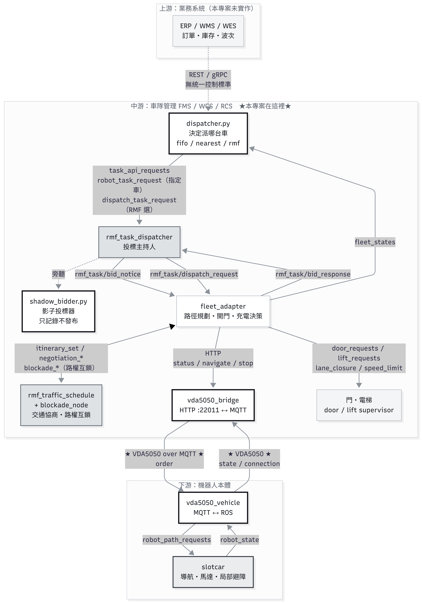
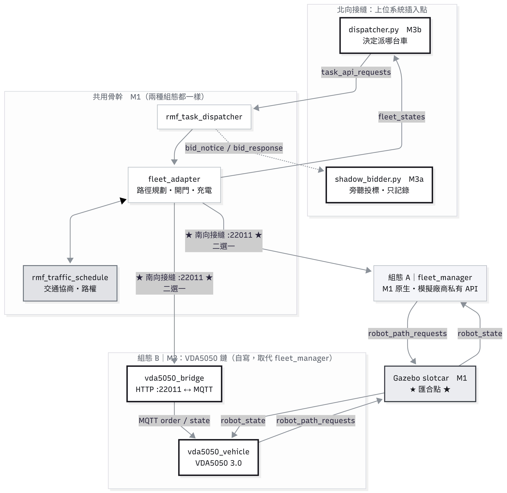
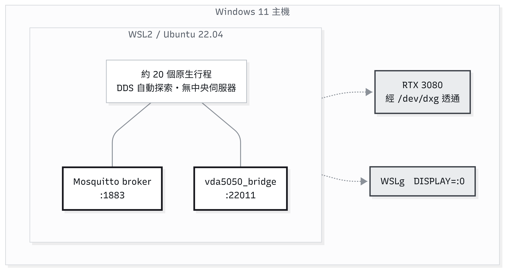

# amr-fms-fifo-dispatcher

把自寫的派工器接進 Open-RMF，並用 VDA5050 3.0 取代廠商私有 API，量測換介面後 KPI 是否劣化。

環境：WSL2 / Ubuntu 22.04 / ROS 2 Humble / Open-RMF `rmf_demos` 2.0.4 / Ignition Fortress


`coe` 任務進來時，`tinyRobot1`（5.1 m）閒置中，FIFO 依「誰先排隊」派了 0.5 秒前才閒置的 `tinyRobot2`（15.1 m）。結果多走 10.0 m，周轉 67.6 s（另外兩趟約 32 s）。

| 畫面 | 內容 | 來源 |
|---|---|---|
| 左 RViz | 路徑規劃、交通協商、開門；綠色為規劃軌跡 | Open-RMF |
| 右上 | 指派 log 與周轉時間 | 本專案 |
| 右中 | VDA5050 3.0 `state` / `order` | 本專案 |
| 右下 | `order_sent` / `cmd_completed`（HTTP ↔ MQTT） | 本專案 |

---

## 目錄

1. [專案目的](#一專案目的)
2. [學習目標](#二學習目標)
3. [架構](#三架構)
4. [一次派工時序](#四一次派工時序)
5. [Port 與行程](#五port-與行程)
6. [上中下游與行為](#六上中下游與行為)
7. [VDA5050](#七vda5050)
8. [官方 schema](#八官方-schema)
9. [做了什麼與結果](#九做了什麼與結果)
10. [驗證方式](#十驗證方式)
11. [目錄與執行](#十一目錄與執行)
12. [邊界與限制](#十二邊界與限制)
13. [授權](#十三授權)

---

## 一、專案目的

交付邊界：自寫派工器接進 Open-RMF 介面，並用業界標準協定與車輛溝通。不重造 Open-RMF 或 rmf-web。

| 元件 | 角色 |
|---|---|
| `dispatcher.py` | 決定派哪台車（`fifo` / `nearest` / `rmf`） |
| `shadow_bidder.py` | 旁聽 RMF 投標，記錄 FIFO vs RMF 選擇 |
| `vda5050_bridge.py` | 北向 HTTP（被 RMF 呼叫）↔ 南向 MQTT（VDA5050） |
| `vda5050_vehicle.py` | VDA5050 3.0 模擬車輛（MQTT ↔ ROS） |

FIFO 刻意只取閒置最久的車，不看距離、電量、壅塞，讓「近車不派、遠車被派」變成可觀測現象，後續才有空間換更好策略。

### 里程碑

| 里程碑 | 內容 | 狀態 |
|---|---|---|
| M0 | WSL2 + ROS 2 Humble 環境、GPU／GUI 驗證 | ✅ |
| M1 | `rmf_demos` office 場景跑通（不寫程式），確認訊息流 | ✅ |
| M3a | 影子投標器：只記錄不發布 | ✅ |
| M3b | 上位派工器：三策略 × 兩輪對照實驗 | ✅ |
| M2 | VDA5050 3.0 取代 `fleet_manager`，量測 KPI | ✅ |
| M4–M7 | 可觀測性面板／更好演算法／官方對照／雲端與 CI | ⬜ |

實際順序是 `M0 → M1 → M3a → M3b → M2`。M2 放最後，是因為中途發現交付邊界偏離——原定「介面被 RMF 呼叫」，實際做成「呼叫 RMF task API」。M2 把「被呼叫」那側補回來。

---

## 二、學習目標

| # | 目標 | 產出 |
|---|---|---|
| 1 | 實作業界標準介面，不自創格式 | VDA5050 3.0 order／state／connection，官方 schema 驗證 |
| 2 | 分清上位系統與車隊控制層職責 | 上位只決定派哪台；路徑、交通、門、充電留給 RMF |
| 3 | 可量測地回答「改動有沒有讓系統變差」 | 三策略 × 多輪對照，先定雜訊底線再比較 |
| 4 | 實驗結果可重現 | 紀錄檔第一行寫入程式碼雜湊，版本不同自動排除 |
| 5 | 多行程系統的故障診斷 | 用訊號區分「元件死了」與「元件被卡住」 |

---

## 三、架構



粗黑框是自寫的四個元件；`vda5050_bridge` 取代原本的 `fleet_manager`（模擬廠商私有 API）。

實際上這條鏈只有兩個可插拔接縫。M1 原生鏈與 M2 的 VDA5050 鏈在同一個 port 上二選一：



```
分岔：HTTP :22011 ← 只有這裡被換掉
固定：dispatcher、RMF 核心、Gazebo、任務序列、間隔
匯合：/robot_path_requests → 同一台 slotcar
```

只有一個變因，KPI 差異才能歸因到介面替換。

| 組態 | 啟動 | 用途 |
|---|---|---|
| A 原生鏈 | `ros2 launch rmf_demos_gz office.launch.xml` | 基準 KPI |
| B VDA5050 鏈 | `ros2 launch fifo_dispatcher office_vda5050.launch.xml` | 對照 |

兩者都另開終端掛同一支派工器與同一組參數。

`shadow_bidder`（M3a）是旁路，不在 M3b 鏈上。M3b 用 `robot_task_request` 直接指定機器人，不經投標，所以投標 topic 在 M3b 路徑上是空的。

---

## 四、一次派工時序


三種策略的差異主要在「什麼時候選」，不在「怎麼選」：

| | 決策者 | 決策時機 | 訊息型別 | 經投標？ |
|---|---|---|---|---|
| fifo | 派工器 | 等車真的空出來才綁定 | `robot_task_request` | ❌ |
| nearest | 派工器 | 同上 | `robot_task_request` | ❌ |
| rmf | RMF | 任務一產生就送出，排進未來行程 | `dispatch_task_request` | ✅ |

fifo 與 nearest 都是延遲承諾；rmf 是立即承諾。實測 KPI 差異主要來自這條軸線，而不是搜尋能力。這也解釋了 RMF 平均周轉好、尾端（最大值）卻最差——早期綁定基於當時預測，後續改不了。

完成判定：`orderId = str(cmd_id)`、`nodeId = f"cmd_{cmd_id}"`。車輛抵達後把 `nodeId` 填進 `state.lastNodeId` 即為完成證據。

時間軸一律用模擬時鐘（取自 `fleet_states` 的 `location.t`）。實測 RTF ≈ 0.9，牆鐘會漂移。

---

## 五、Port 與行程



目前沒有容器，全部是 WSL 原生行程，靠 DDS 自動探索，不需配置 IP。下表 port 是 HTTP／MQTT 服務。

| Port | 服務 | 說明 |
|---|---|---|
| 22011 | `vda5050_bridge` | 北向 HTTP，被 `fleet_adapter` 呼叫（原本是 `fleet_manager`） |
| 1883 | Mosquitto | VDA5050 MQTT broker |
| 8006 | `schedule_visualizer` | WebSocket，供 RViz 取時刻表 |

DDS 不適合跨雲端（假設在受信任封閉區網），這也是 VDA5050 選 MQTT 的原因之一。

---

## 六、上中下游與行為

看行為時可問三句：

1. 誰做？→ 上游 / 中游 / 下游  
2. 有沒有訊息跑出來？→ 有＝有介面；沒有＝封裝在內部  
3. 我做了嗎？→ 做了 / 委派 / 沒做  

### 介面狀態

| 狀態 | 意義 | 例子 |
|---|---|---|
| 業界標準介面 | 有規範、換廠商不用改 | VDA5050 `order` / `state` |
| 框架專屬介面 | 看得見的 ROS topic，但只在 RMF 生態有意義 | `task_api_requests`、`bid_notice` |
| 無介面（封裝） | 在別人行程內部，外面收不到 | 成本計算、路徑規劃、充電決策 |

VDA5050 是**車輛介面**，不是派工介面。派工走 ROS。正確堆疊是：

```
語意層  VDA5050 schema / rmf_*_msgs / HTTP JSON
傳輸層  MQTT / ROS 2 DDS / TCP
```

Open-RMF 是系統，不是介面。

### 角色

| 角色 | 層 | 本專案 |
|---|---|---|
| Allocator（派工決策） | 中游 | `dispatcher.py` |
| Observer | 中游 | `shadow_bidder.py`、KPI |
| Fleet Controller | 中游 | RMF `fleet_adapter` |
| Traffic Manager | 中游 | `rmf_traffic_schedule` + `blockade_node` |
| Facility Manager | 中游 | door／lift supervisor |
| Vehicle Gateway | 中↔下游 | `vda5050_bridge` |
| Vehicle Agent | 下游 | `vda5050_vehicle` |
| Vehicle | 下游 | Gazebo `slotcar` |

### 行為涵蓋

把 VDA5050 schema、Open-RMF ROS 訊息、`rmf_api_msgs` 的 49 個 API schema 比對後，這條鏈上可辨識行為共 98 種：

| 歸屬 | 全部 | 已做 | 部分 | 未做／委派 |
|---|---:|---:|---:|---:|
| 車輛 | 26 | 8 | 3 | 15 |
| 任務 | 23 | 5 | 3 | 15 |
| 交通與資源 | 14 | 0 | 1 | 13 |
| 生命週期與健康 | 11 | 0 | 0 | 11 |
| 人工介入與緊急 | 9 | 2 | 0 | 7 |
| 觀測與治理 | 6 | 4 | 0 | 2 |
| 能源 | 5 | 2 | 0 | 3 |
| 連線與異常 | 4 | 4 | 0 | 0 |
| **合計** | **98** | **25** | **8** | **65** |

未做的 65 種大多是刻意委派給 RMF（路徑、交通、門電梯、任務生命週期），少數是規範完整範圍（29 個預定義動作、8 個 topic 中的 5 個）。單一廠商也很少全做。

實作重點：

- 任務分配（fifo／nearest）、FIFO 佇列、承諾時機、執行追蹤、完成判定（`state.lastNodeId == cmd_N`）
- VDA5050 `order` / `state` / `connection`（含 Last Will → `CONNECTION_BROKEN`）
- 停車、狀態回報、錯誤回報、replan 觸發
- 決策理由與 KPI 紀錄（JSON Lines）、`code_sha` 版本標記
- 投標旁聽（M3a）

RMF 的拍賣、協商、充電插入是 Open-RMF 的實作選擇，不是業界規範。換成 OpenTCS 做法會不同。

### 指派六階段

| 階段 | 內容 | 本專案 |
|---|---|---|
| ① 訂單 | 任務產生 | `dispatcher.py` 依序輪替，各策略序列相同 |
| ② 分配 | 投標或直接指派 | `dispatch_task_request` / `robot_task_request` |
| ③ 序列 | 誰先誰後 | FIFO 佇列 |
| ④ 承諾時機 | 何時綁定到車 | RMF＝立即；fifo／nearest＝等車空 |
| ⑤ 執行追蹤 | 開始／完成／拒絕／逾時 | `fleet_states` 的 `task_id` |
| ⑥ 拒絕與重排 | 超時不接單 | 突發 30 筆時 RMF 只接受 20 筆 |

### 車輛行為（VDA5050 可見部分）

| 行為 | 欄位 |
|---|---|
| 座標與朝向 | `state.mobileRobotPosition`（x, y, theta, mapId），theta ∈ [-π, π] |
| 電量 | `state.powerSupply.stateOfCharge`（0–100） |
| 接單 | `order`：`orderId` / `orderUpdateId` / `nodes`，重送同號＝冪等丟棄 |
| 抵達 | `state.lastNodeId` → `cmd_<id>` |
| 異常 | `state.errors[].errorType` |
| 連線 | `connection.connectionState` |

VDA5050 之下（車輛控制器內部，本專案由 Gazebo slotcar 模擬）：轉彎、加減速、輪速、局部避障、SLAM。標準只給目標點與路徑，怎麼走是車輛自己的事。

碰撞不是車輛行為：RMF 在中游事先協商路權（log 可見 `Active negotiation` → `Resolved negotiation`）。VDA5050 這層只有「我被擋住了」（`BLOCKED_BY_OTHER_ROBOT`）這類回報。

充電是跨層的，不走 topic：決策在中游 `fleet_adapter`（依設定檔門檻與導航圖 `is_charger` 站點），執行在下游。VDA5050 只看到往充電站的 order 與 `stateOfCharge` 數字。

---

## 七、VDA5050

VDA5050 是德國汽車工業協會（VDA）與 VDMA 制定的「車隊管理系統 ↔ 移動機器人」通訊標準，走 MQTT、訊息用 JSON。本專案實作 3.0 版（協定版本 `3.0.0`，2026-03-18 發布）；schema 取自官方 repo 發布後的勘誤修訂。

沒有標準時，每家 AMR 廠商都有私有 API，換廠商上位系統要重寫。VDA5050 把這條線標準化：換機器人廠商，上位系統不用改。

`rmf_demos` 原本用 `fleet_manager` 模擬廠商私有 API（HTTP :22011）。本專案不啟動它，改由 `vda5050_bridge` 接手同一個 port，把 RMF 的 HTTP 呼叫翻譯成 VDA5050 MQTT。`vda5050_bridge` 刻意不是 ROS 節點——真實廠商軟體通常不跑在 ROS 上。

3.0 相對 2.x 的改名：

| 2.x | 3.0 |
|---|---|
| `agvPosition` | `mobileRobotPosition` |
| `batteryState` | `powerSupply` |
| `batteryState.batteryCharge` | `powerSupply.stateOfCharge` |

---

## 八、官方 schema

`schemas/` 下三個檔案是 VDA5050 3.0 官方 JSON Schema（draft 2020-12），未經修改，已用 sha256 與上游比對確認相同。

取自官方 repo `main` @ `ea7c62a`（2026-06-17），是 3.0.0 發布後的勘誤修訂（例如把 `theta` 單位由誤植的 `m` 更正為 `rad`）。與 tag `3.0.0` 的差異見 [`schemas/NOTICE.md`](schemas/NOTICE.md)。

| Topic | Schema | 頂層必要欄位 |
|---|---|---|
| `.../order` | `order.schema` | 9（含 `headerId`, `timestamp`, `version`, `manufacturer`, `serialNumber`, `orderId`, `orderUpdateId`, `nodes`, `edges`） |
| `.../state` | `state.schema` | 18（前 7 項 + `lastNodeId`, `lastNodeSequenceId`, `nodeStates`, `edgeStates`, `driving`, `actionStates`, `instantActionStates`, `powerSupply`, `operatingMode`, `errors`, `safetyState`） |
| `.../connection` | `connection.schema` | 6（前 5 項 + `connectionState`） |

Topic 命名：`vda5050/v3/<manufacturer>/<serialNumber>/{order,state,connection}`

`connectionState`：`ONLINE` / `OFFLINE` / `HIBERNATING` / `CONNECTION_BROKEN`。`CONNECTION_BROKEN` 由 MQTT Last Will 送出，可與正常 `OFFLINE` 區分。本專案實作三個，`HIBERNATING` 未做。

`errorType` 是可擴充列舉，預定義值為 UPPER_SNAKE_CASE。本專案使用：

| 用途 | errorType | 來源 |
|---|---|---|
| order 格式不合 | `VALIDATION_FAILURE` | 規範預定義 |
| 沒停在目標點 | `NODE_UNREACHABLE` | 規範預定義 |
| 計畫與實際位置差太遠 | `OUTSIDE_OF_CORRIDOR` | 規範預定義 |
| 有別人在指揮同一台車 | `OTHER_ORDER_ACTIVE` | 規範預定義 |
| 被別台車擋住 | `BLOCKED_BY_OTHER_ROBOT` | 自訂 |
| 送出後車輛始終沒認領 | `ORDER_NOT_ACCEPTED` | 自訂 |
| 估計時間不合量級 | `IMPLAUSIBLE_ETA` | 自訂 |
| order 內容不可執行 | `ORDER_NOT_EXECUTABLE` | 自訂 |

通過 schema ≠ 符合規範。`errorType` 型別只是 `string`，自創命名也會通過驗證，但真實車輛送規範值時會對不上。本專案改用規範命名。

---

## 九、做了什麼與結果

| 里程碑 | 產出 |
|---|---|
| M1 | office 場景跑通，實測訊息流後畫架構圖 |
| M3a | `shadow_bidder.py`：旁聽投標，比較 FIFO 與 RMF |
| M3b | `dispatcher.py`：三策略可切換；三策略 × 兩輪 → 基準 KPI |
| M2 | `vda5050_vehicle.py`、`vda5050_bridge.py`、`launch/office_vda5050.launch.xml`；重跑對照 → KPI 未劣化 |
| 貫穿 | `version.py`：資料版本標記 |

把廠商私有 API 換成 VDA5050 後，端到端 KPI 沒有劣化。12 項比較（3 策略 × 4 指標）沒有任何一項超出雜訊變差。四組實驗共 490 張 order，`order_rejected` 0 次。

鏈路延遲（實測）：

```
下行 bridge → vehicle  平均 0.338s  中位數 0.078s
上行 vehicle → bridge  平均 0.049s  中位數 0.001s
每段合計約 0.39s → 單筆任務（10–13 段）多出約 4–5 秒
```

這個量級小於策略之間的差異（fifo 與 nearest 平均周轉差約 34 s），也小於同一策略的跨輪變異，不影響策略比較結論。

三種策略差異主要來自承諾時機：

| 指標 | 結果 |
|---|---|
| 平均周轉 | `rmf ≈ nearest ≪ fifo` |
| 等待時間 | `nearest ≪ rmf < fifo` |
| 尾端（最大） | `nearest ≪ fifo < rmf` |

RMF 用尾端換平均；FIFO 的價值是公平性與決策時間有界，不是效率。

---

## 十、驗證方式

### 1. 協定合規：用官方 schema 驗證實際訊息

```bash
mosquitto_sub -h localhost -t 'vda5050/v3/rmfdemos/tinyRobot1/state' -C 20 > /tmp/state.jsonl
python3 tools/vda5050_schema_check.py state /tmp/state.jsonl
```

結束碼 0 = 全部通過，1 = 有不符。實測：state 25/25、order 3/3、connection 1/1，以 `Draft202012Validator` 通過。

腳本會印出實際使用的驗證器。`jsonschema < 4.18` 不認得 draft 2020-12 會靜靜退回 Draft7，不印出來時「通過」結論會比實際情況更強。

### 2. 失敗路徑

```bash
mosquitto_pub -h localhost -t 'vda5050/v3/rmfdemos/tinyRobot1/order' -m '{"orderId":"bad-1"}'
```

預期：車輛拒絕並回報 `VALIDATION_FAILURE`，state 的 `errors` 出現該錯誤，JSON Lines 寫入 `order_rejected`。實測通過。

### 3. 全鏈驗證（不需 Gazebo）

`tools/fake_slotcar.py` 可在沒有模擬器的情況下走完整條鏈：

```
curl → bridge → MQTT order → vehicle → PathRequest → 假 slotcar
     → robot_state → vehicle → MQTT state → bridge → last_completed_request
```

```bash
bash tools/verify_chain.sh
```

腳本開頭斷言環境為空，結尾檢查行程是否消失與 port 是否釋放。實測：3 秒就緒、cmd 完成、殘留行程 0、22011 已釋放。

### 4. 資料可比性：版本標記

每個紀錄檔第一行是程式碼內容雜湊：

```json
{"event":"run_started","policy":"fifo","code_sha":"64e03d438924",
 "files":{"dispatcher.py":"8327fcbb","vda5050_bridge.py":"c0601bc7", ...},
 "code_dir":"/root/rmf_ws/install/..."}
```

分析腳本會自動排除版本不一致或無標記的資料。用內容雜湊而非 git hash 或 mtime：實驗常在未 commit 狀態下跑，`colcon build` 的複製也不保證帶 mtime。

### 5. KPI 判準

差距要能宣稱，必須大於同一策略的跨輪變異。只跑一輪時，`rmf` 平均周轉曾顯示「+11.3 s、超出雜訊」；補跑第二輪後，自身跨輪變異約 8.0 s，同一個差距落回雜訊內。單輪「超出雜訊」不能當結論。

### 6. 故障診斷

RViz 只剩平面圖、車輛圖示消失時：

| | adapter 行程數 | log 特徵 | 任務結果 |
|---|---|---|---|
| 元件死了 | 0 | `AttributeError: 'NoneType'` + `process has died` | 完全零筆 |
| 元件被卡住 | 1 | 大量 `Read timed out (5.0s)` | 部分完成 |

實驗腳本成功判準看資料不看行程——一組跑完後數結果檔的 `completed` 筆數，不足就整組重跑。

---

## 十一、目錄與執行

```
amr-fms-fifo-dispatcher/
├── docs/                          # 圖與示範動畫
├── src/fifo_dispatcher/           # ROS 2 套件（ament_python）
│   ├── fifo_dispatcher/
│   │   ├── dispatcher.py
│   │   ├── shadow_bidder.py
│   │   ├── vda5050_bridge.py      # 非 ROS 節點
│   │   ├── vda5050_vehicle.py
│   │   └── version.py
│   └── launch/office_vda5050.launch.xml
├── schemas/                       # VDA5050 3.0 官方 schema（未修改）
└── tools/                         # 測試與分析（非交付元件）
    ├── fake_slotcar.py
    ├── vda5050_schema_check.py
    ├── verify_chain.sh
    └── m2_kpi.py / m2_latency.py
```

### 前置

`package.xml` 只宣告有 rosdep key 的相依。`vda5050_bridge` 另外需要：

```bash
/usr/bin/python3 -m pip install -r requirements.txt
```

[`requirements.txt`](requirements.txt) 標註了實測版本與授權，並說明哪些由 ROS 環境提供（不該用 pip 裝）。

### 建置

```bash
source /opt/ros/humble/setup.bash && cd ~/rmf_ws && colcon build --packages-select fifo_dispatcher
```

### 啟動（不啟動 `fleet_manager`）

```bash
source /opt/ros/humble/setup.bash && source ~/rmf_ws/install/setup.bash && ros2 launch fifo_dispatcher office_vda5050.launch.xml
```

### 派工

```bash
ros2 run fifo_dispatcher dispatcher --ros-args -p policy:=fifo -p count:=8 -p interval_sec:=25.0
```

`policy` 可選 `fifo` / `nearest` / `rmf`。

不要把 vehicle 掛到原本的 `office.launch.xml` 上。即使不派任務，`fleet_manager` / `fleet_adapter` 仍會每隔數秒發新指令搶走車輛（實測 `task_id` 34 → 36 → 42 → 52），`toggle_action` 擋不掉。

---

## 十二、邊界與限制

不做的事：
- 不修改 `rmf_demos` 任何原始碼
- 不重造 Open-RMF 的路徑規劃、交通協商、開門、充電
- 不重造 rmf-web

已知限制：

| 項目 | 現況 |
|---|---|
| 規模 | 2 台車、單一車隊、模擬環境；壓力測試到 30 筆突發 |
| 真機 | 全模擬 |
| CI / 雲端部署 | 未做 |
| 前端 | 只有終端機與 JSON Lines |
| `HIBERNATING` | 未實作 |
| VDA5050 `actions` | 未實作，如實回報 `FAILED` |
| 絕對基準 | 只有策略互比，沒有離線最佳解 |
| 間歇性 `Read timed out` | 成因尚未查明（已知的 async + Lock 缺陷已修） |

---

## 十三、授權

### 本專案

Copyright 2026 Testa Wu — Apache License 2.0，完整條款見 [`LICENSE`](LICENSE)。

選擇 Apache-2.0 是為了與 Open-RMF／ROS 2 生態一致，且本專案沒有 copyleft 相依。

### 第三方與衍生部分

完整說明見 [`NOTICE.md`](NOTICE.md)。摘要：

| 元件 | 授權 | 說明 |
|---|---|---|
| `schemas/*.schema` | MIT | VDA5050 官方 schema（`main` @ `ea7c62a`），未經修改。著作權與授權全文見 [`schemas/NOTICE.md`](schemas/NOTICE.md) |
| 衍生自 `rmf_demos` 2.0.4 | Apache-2.0 | `vda5050_bridge` 沿用 HTTP 端點形狀、`office_vda5050.launch.xml` 沿用 launch 參數。未複製程式碼、未修改上游原始碼。Copyright 2021 Open Source Robotics Foundation, Inc. |
| ROS 2 Humble、Open-RMF | Apache-2.0 | 執行時相依，原始碼不含在本 repo |
| FastAPI、pydantic、PyYAML、jsonschema | MIT | 版本見 [`requirements.txt`](requirements.txt) |
| uvicorn | BSD-3-Clause | |
| paho-mqtt 1.5.1 | EPL-1.0 / EDL-1.0（雙授權） | 2.x 起改為 EPL-2.0 OR BSD-3-Clause |
| 遞移相依 | MIT／BSD／PSF | `pip-licenses` 掃描：無 GPL／AGPL／未知授權 |
| Eclipse Mosquitto | EPL-2.0 + EDL-1.0 | 外部服務，非相依套件、未散布 |
| Ignition Gazebo Fortress | Apache-2.0 | 外部工具 |

上表於 2026/08/14 直接查證：ROS／Open-RMF 取自本機 `package.xml` 的 `<license>`，Python 套件取自 PyPI，VDA5050 與 Mosquitto 取自官方授權檔。商業用途前建議以 `pip-licenses` 確認完整遞移相依樹。

### 聲明

本專案為個人練習，與 Open Robotics、VDA、VDMA 均無隸屬關係，亦非任何組織的官方實作。
