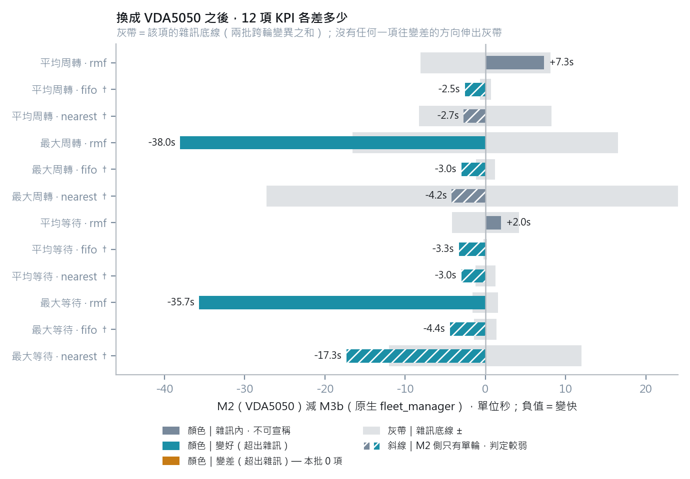
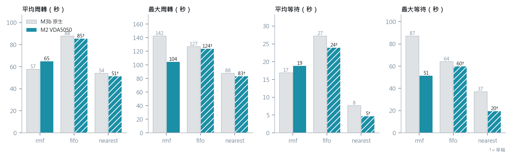
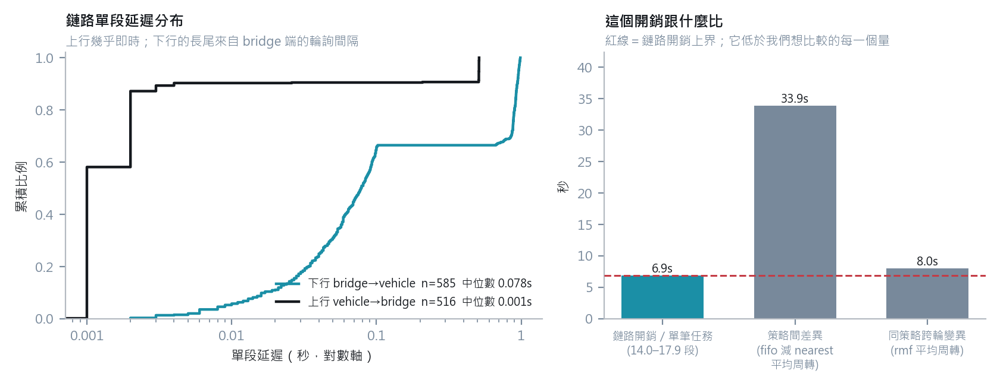

# M2：換成 VDA5050 介面之後，端到端 KPI 有沒有劣化

> **本檔由 `experiments/kpi_report.py` 從原始 JSON Lines 產生，請勿手動編輯。**
> 數字的正本是原始資料本身；文字結論的正本是
> `notes/M2-步驟5-對照實驗結果.md`（個人工作紀錄，不進 repo）。
>
> 程式版本 `code_sha = 285d4984571b`　·　實驗日期 2026/08/13　·
> 採用組別 rmf_r1, rmf_r2, fifo_r1, nearest_r1（共 4 組，每組 8 張任務）

---

## 一、結論

**0 項超出雜訊變差。** 12 項比較（3 策略 × 4 指標）中，
4 項落在雜訊底線內、8 項優於基準；VDA5050 側共發出
**490 張 order**，被拒次數**無法判定**（這批未留下車端紀錄）——詳見〈VDA5050 側〉。

⚠️ 其中 **8 項的 M2 側只有單輪**（fifo、nearest 各只跑了 r1），
雜訊底線只含 M3b 自己的跨輪變異，涵蓋不到 M2 的波動。
**這些列標「變好」者不可對外宣稱**——同樣的情形在 rmf 身上發生過：
只看 r1 時判定是「超出雜訊變差 +11.3s」，補上 r2 之後就落回雜訊內。

---

## 二、12 項比較



判準沿用 M3b：**差距要能被宣稱，必須大於雜訊底線**
（＝兩批各自「同一策略跨輪的最大差」之和）。落在底線內的一律不下結論。

| 指標 | 策略 | M3b（原生） | M2（VDA5050） | 差距 | 雜訊底線 | 判定 |
|---|---|---|---|---|---|---|
| 平均周轉 | rmf | 57.5 | 64.8 | +7.3 | 8.1 | 雜訊內，未劣化 |
| 平均周轉 | fifo | 87.8 | 85.3 | -2.5 | 0.7 | 變好 2.5s（超出雜訊）（單輪） |
| 平均周轉 | nearest | 54.0 | 51.3 | -2.7 | 8.3 | 雜訊內，未劣化（單輪） |
| 最大周轉 | rmf | 142.5 | 104.5 | -38.0 | 16.5 | 變好 38.0s（超出雜訊） |
| 最大周轉 | fifo | 126.6 | 123.6 | -3.0 | 1.2 | 變好 3.0s（超出雜訊）（單輪） |
| 最大周轉 | nearest | 87.6 | 83.4 | -4.2 | 27.3 | 雜訊內，未劣化（單輪） |
| 平均等待 | rmf | 16.8 | 18.8 | +2.0 | 4.2 | 雜訊內，未劣化 |
| 平均等待 | fifo | 27.2 | 23.9 | -3.3 | 0.2 | 變好 3.3s（超出雜訊）（單輪） |
| 平均等待 | nearest | 7.7 | 4.7 | -3.0 | 1.2 | 變好 3.0s（超出雜訊）（單輪） |
| 最大等待 | rmf | 87.1 | 51.5 | -35.7 | 1.6 | 變好 35.7s（超出雜訊） |
| 最大等待 | fifo | 64.2 | 59.8 | -4.4 | 1.4 | 變好 4.4s（超出雜訊）（單輪） |
| 最大等待 | nearest | 36.9 | 19.6 | -17.3 | 12.0 | 變好 17.3s（超出雜訊）（單輪） |



---

## 三、VDA5050 側：order 發出與被拒

| 組別 | order 發出 | cmd 完成 | 段/任務 |
|---|---|---|---|
| rmf r1 | 143 | 128 | 17.9 |
| rmf r2 | 116 | 112 | 14.5 |
| fifo r1 | 119 | 103 | 14.9 |
| nearest r1 | 112 | 98 | 14.0 |
| **合計** | **490** | **441** | — |

> 「cmd 完成」少於「order 發出」是正常的：`vda5050_bridge.py` 的 `_send_order`
> 直接覆寫該車的待辦指令，被後續指令取代的那一張不會寫出 `cmd_completed`。

### ⚠️ 「零拒絕」這件事，這批資料證明不了

`order_rejected` **只由 `vda5050_vehicle.py` 寫進車端紀錄**，`vda5050_bridge.py`
從不寫這個事件。因此在 bridge 紀錄裡數 `order_rejected` **永遠是 0**——
那不是量測結果，是量錯了檔案（原則 7 的代理指標）。

而這四組**沒有保存車端紀錄**（`run_20260813_2033/` 下沒有
`vda5050_tinyRobot*.jsonl`），所以**這 490 張 order 有沒有被拒，
無法從留存資料回答**。

現有的車端紀錄只有跨世代、無版本標記的那一份，統計如下——它**不是**上表這四組：

| 車端紀錄（跨世代，無版本標記） | 數量 |
|---|---|
| 檔案數 | 2 |
| `order_received` | 1230 |
| `order_rejected` | **0** |

也就是說：**目前能講的是「另一批 1230 筆
order_received 中 0 筆被拒」**，不是「這四組 490 張 order 零拒絕」。
要補上這個驗收條件，實驗腳本必須把車端 log 一起收進 run 目錄。

---

## 四、鏈路延遲



```
下行 bridge → vehicle   n=585  平均 0.338s  中位數 0.078s
上行 vehicle → bridge   n=516  平均 0.049s  中位數 0.001s
每段合計約 0.39s  ×  每任務 14.0–17.9 段
  → 單筆任務多出約 5.4–6.9s
```

這個量級小於策略之間的差異（fifo 與 nearest 的平均周轉差
33.9s），也小於同一策略的跨輪變異
（rmf 8.0s），因此不影響策略比較的結論。

⚠️ **「段/任務」與舊文件不一致。** 舊版 `m2_latency.py` 把段數**寫死**為 10–13
（因而得到 4–5s/任務），這個數字進了 README 與 `notes/` 的多份文件，
但**從留存資料重算不出來**：這四組實測是每任務 14.0–17.9 張 order
（若改數「相異目標點」則是 5.6–8.8）。本檔一律採「order 張數」——
每張 order 就是一次下行＋一次上行，那才是延遲要乘的次數。

⚠️ **延遲資料的限制**：車端紀錄（`vda5050_tinyRobot*.jsonl`）**沒有版本標記、
且混了三個世代**，與〈VDA5050 側〉那 4 組不是同一批。此節僅供**量級參考**，
不作為驗收依據。段/任務則取自有版本標記的 4 組。

---

## 五、這批資料不能拿來宣稱的事

| # | 限制 | 影響 |
|---|---|---|
| 1 | fifo、nearest 只有單輪（8 列） | 其中判定「變好」的 6 列**不可對外宣稱**，只能說「未變差」 |
| 2 | 車端延遲資料跨世代、無版本標記 | 〈鏈路延遲〉只能講量級，不能講精確值 |
| 3 | 這批未保存車端紀錄 | **「order 零拒絕」無法驗證**（見〈VDA5050 側〉）；下一輪實驗要把車端 log 收進 run 目錄 |
| 4 | rmf r2 曾出現 `Read timed out` 風暴，成因未知 | 重跑後 0 次逾時、8/8 完成，但**間歇性缺陷仍在**；當時的 log 被同名覆蓋而遺失 |
| 5 | 每組僅 8 張任務、2 台車 | 樣本小；結論限於 office 場景這個規模 |

---

## 六、重現

原始資料在 `notes/`（個人工作紀錄，不進 repo）。有資料時：

```bash
PYTHONIOENCODING=utf-8 python experiments/kpi_report.py
```

資料放在別處時用環境變數指定：

```bash
M3B_DATA_DIR=<M3b jsonl 目錄> M2_DATA_DIR=<M2 jsonl 目錄> \
M2_VEHICLE_GLOB='<車端 jsonl glob>' python experiments/kpi_report.py
```

只要表格數字（不產圖）：`python tools/m2_kpi.py`；只要延遲：`python tools/m2_latency.py`。

> 這裡比的是**介面**，Open-RMF 在兩邊都在、沒被換掉。
> 要看「自寫派工器 vs RMF 自己投標」，見 [M3b-策略對照.md](M3b-策略對照.md)。
