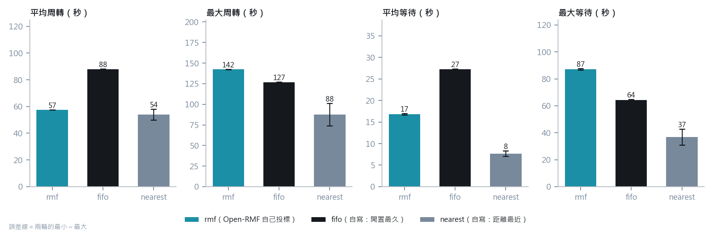
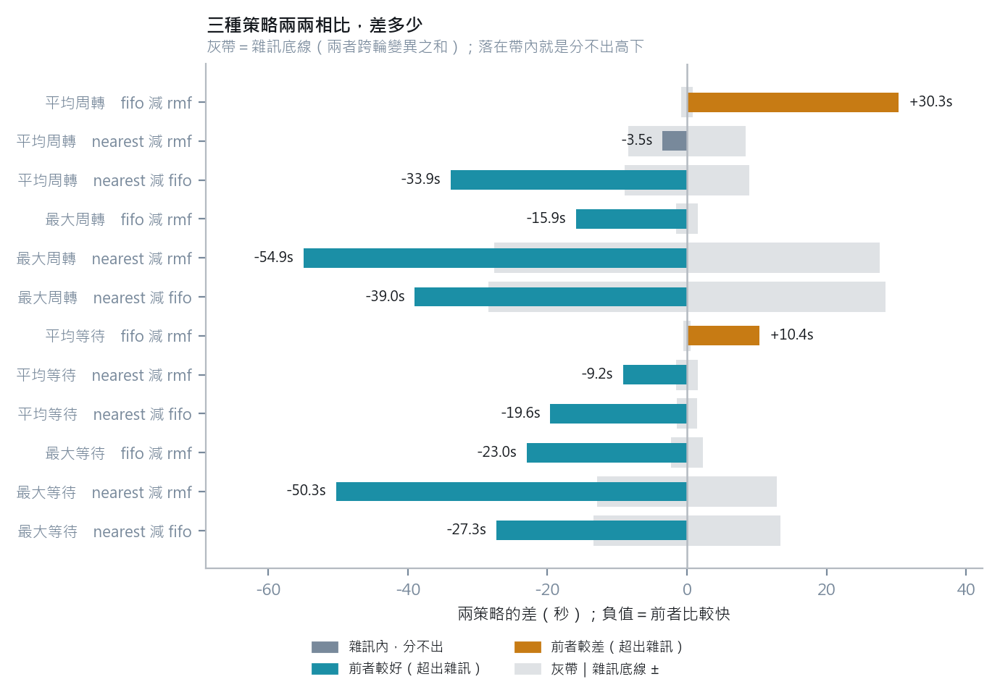
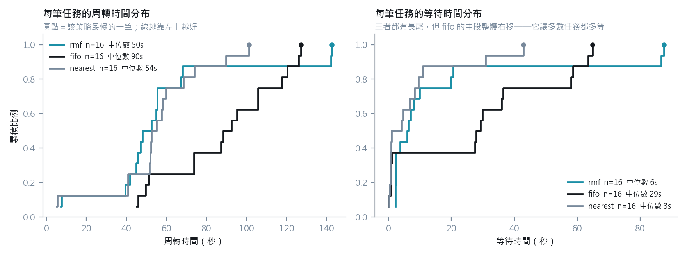

# 三種派工策略的對照：自寫的 FIFO／nearest vs Open-RMF 自己投標

> **本檔由 `experiments/policy_report.py` 從原始 JSON Lines 產生，請勿手動編輯。**
>
> 資料：M3b 六組（3 策略 × 2 輪，走 `rmf_demos` 原生 `fleet_manager`），
> 共 48 筆任務、每組 8 張。
> 這批**每個策略都有兩輪**，算得出雜訊底線；M2 那批 fifo／nearest 只有單輪，不適合做策略軸。

---

## 這張表回答的問題，跟〈M2 KPI 對照〉不一樣

| | 介面軸（[M2-KPI對照.md](M2-KPI對照.md)） | 策略軸（本檔） |
|---|---|---|
| 換掉什麼 | 車端介面：原生 `fleet_manager` → 自寫 VDA5050 橋接 | 派工策略：誰來決定「這張單給哪台車」 |
| Open-RMF | **兩邊都在，沒被換掉**（dispatcher、fleet_adapter、交通協商都是 RMF） | `rmf` 這一組就是**讓 RMF 自己投標選車** |
| 問題 | 換了會不會變慢 | 自寫的派工器跟 RMF 自己派，差在哪 |

三個策略在紀錄裡的決策理由（`reason` 欄）長這樣：

| 策略 | 誰決定 | `reason` 實例 |
|---|---|---|
| `rmf` | **Open-RMF 的投標機制** | `RMF 自行投標選車` |
| `fifo` | 自寫：挑閒置最久的 | `閒置最久（tinyRobot1=23.9s）` |
| `nearest` | 自寫：挑距離最近的 | `距離最近（tinyRobot1=1.44m）` |

---

## 一、四項指標



| 指標 | rmf（Open-RMF 自己投標） | fifo（自寫：閒置最久） | nearest（自寫：距離最近） |
|---|---|---|---|
| 平均周轉 | 57.5　±0.1 | 87.8　±0.4 | 54.0　±4.1 |
| 最大周轉 | 142.5　±0.2 | 126.6　±0.6 | 87.6　±13.6 |
| 平均等待 | 16.8　±0.2 | 27.2　±0.1 | 7.7　±0.6 |
| 最大等待 | 87.1　±0.4 | 64.2　±0.7 | 36.9　±6.0 |

（± 是兩輪最小～最大的一半，不是標準差——只有兩輪，寫標準差會讓人高估樣本量。）

---

## 二、兩兩相比：哪些差距真的存在



判準與介面軸一致：**差距要大於兩者跨輪變異之和才算數**。
12 項比較中 1 項落在雜訊內，分不出高下。

| 指標 | 比較 | 前者 | 後者 | 差距 | 雜訊底線 | 判定 |
|---|---|---|---|---|---|---|
| 平均周轉 | fifo 減 rmf | 87.8 | 57.5 | +30.3 | 0.8 | fifo 較差 30.3s |
| 平均周轉 | nearest 減 rmf | 54.0 | 57.5 | -3.5 | 8.4 | 雜訊內，分不出 |
| 平均周轉 | nearest 減 fifo | 54.0 | 87.8 | -33.9 | 9.0 | nearest 較好 33.9s |
| 最大周轉 | fifo 減 rmf | 126.6 | 142.5 | -15.9 | 1.6 | fifo 較好 15.9s |
| 最大周轉 | nearest 減 rmf | 87.6 | 142.5 | -54.9 | 27.6 | nearest 較好 54.9s |
| 最大周轉 | nearest 減 fifo | 87.6 | 126.6 | -39.0 | 28.4 | nearest 較好 39.0s |
| 平均等待 | fifo 減 rmf | 27.2 | 16.8 | +10.4 | 0.5 | fifo 較差 10.4s |
| 平均等待 | nearest 減 rmf | 7.7 | 16.8 | -9.2 | 1.6 | nearest 較好 9.2s |
| 平均等待 | nearest 減 fifo | 7.7 | 27.2 | -19.6 | 1.5 | nearest 較好 19.6s |
| 最大等待 | fifo 減 rmf | 64.2 | 87.1 | -23.0 | 2.3 | fifo 較好 23.0s |
| 最大等待 | nearest 減 rmf | 36.9 | 87.1 | -50.3 | 12.9 | nearest 較好 50.3s |
| 最大等待 | nearest 減 fifo | 36.9 | 64.2 | -27.3 | 13.4 | nearest 較好 27.3s |

---

## 三、分布：平均值講不出來的部分



---

## 四、看得出什麼

**1. `nearest` 全面不輸 `rmf`，尾端明顯較好。**
平均周轉 54.0s vs 57.5s（落在雜訊內，分不出），
但最大周轉 87.6s vs 142.5s、平均等待
7.7s vs 16.8s，都是超出雜訊的差距。
**在這個場景、這個規模下，一個十幾行的「挑最近的」贏過 RMF 的投標機制。**

**2. `fifo` 慢，而且是設計上的慢。** 平均周轉 87.8s，
比另外兩者都高。它刻意不看距離，只看誰閒得久——換來的是公平性與
決策時間有界（不需要跑成本函式），代價就在這張表上。

**3. RMF 的取捨是「尾端換平均」。** 它的平均周轉跟 `nearest` 分不出高下，
但最大周轉 142.5s 是三者中最差。分布圖看得最清楚：
`rmf` 的曲線在中段很好，右端拖出一條長尾。

---

## 五、這批資料不能拿來宣稱的事

| # | 限制 | 影響 |
|---|---|---|
| 1 | 每策略只有兩輪、每輪 8 張任務、2 台車 | 雜訊底線是「兩輪的差」，不是統計意義上的信賴區間；樣本小 |
| 2 | 只有 office 一個場景 | 「nearest 贏」很可能是這個場域尺度（15.6×9.3m、兩台車）的結果，換到大場域、多車、有交通壅塞時 RMF 的協商價值才會顯現 |
| 3 | 任務型態單一（patrol，無取放、無充電） | RMF 的排程優勢（電量、充電站、多階段任務）完全沒被測到 |
| 4 | `rmf` 組的決策在 RMF 內部 | 我們只看得到結果，看不到它的成本函式怎麼算——不能解釋「為什麼」它選了那台 |

> 第 2、3 點特別重要：**這張表不是「自寫派工器優於 Open-RMF」的證據**，
> 只是「在這個小場景的巡邏任務上，簡單策略就夠用」。

---

## 六、重現

```bash
PYTHONIOENCODING=utf-8 python experiments/policy_report.py
```

資料在別處時：`M3B_DATA_DIR=<M3b jsonl 目錄> python experiments/policy_report.py`
